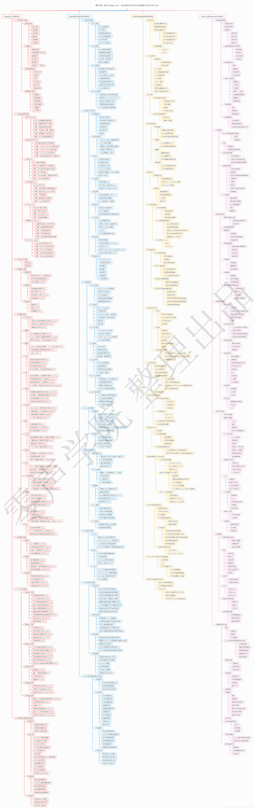

# cpp-interviews-questions

请按照issue模板提交面试问题，[年份-公司几面-公司几面]题目简要内容。 正文中贴上题目即可，不需要解答。

如果有解答方案链接或代码可回复，讨论请勿回复，群里讨论即可。

# Linux后台开发-C++技术栈知识点梳理（社招要求）

详细大图请点击[这里](https://raw.githubusercontent.com/zhangyuanes/cpp-interviews-questions/main/knowledge-tree.png)。

